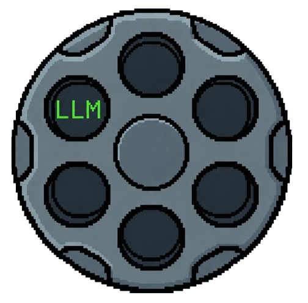

<p align="left">
  
</p>

# Revolver

Revolver runs **AI models on your machine**. Point it at GGUF files (and, on macOS, MLX / safetensors), pick a checkpoint, and it starts an inference server for you. No CLI flags, no `docker run` to remember.

The UI is a React app with four areas: **Chat** (multi-turn against a running server), **Server** (create/stop instances, load models, tail logs), **Config** (paths, defaults, runtimes), and **Monitor** (GPU/VRAM and load progress). Chat supports markdown, math (KaTeX), and reasoning traces when the model emits them.

Revolver is a **control plane**, not the inference engine. A Node backend scans disk for models, reads metadata, estimates VRAM, and persists server definitions. When you load a model it starts **one inference process per server** — a native `llama-server` on the host, or (optionally) a Docker container. Each server can pin a GPU. Revolver tracks lifecycle, parses logs, and proxies chat through a single OpenAI-compatible gateway. Weights stay on disk.

---

## Install

Desktop builds: [GitHub Releases](https://github.com/TownsendBrown/revolverllm/releases). Thin Electron shell — llama.cpp / MLX download on first use ([Runtimes](#runtimes)).

### Windows

1. Download `Revolver-<version>-win-x64.exe` (NSIS, per-user, no admin).
2. Run Setup. Unsigned — SmartScreen **More info → Run anyway**.
3. Launch **Revolver**. Config, models, and runtimes: `%APPDATA%\Revolver`. Uninstall leaves them.

NVIDIA driver for CUDA. GPU vendor Vulkan ICD for Vulkan. Neither ships in the installer.

### Linux

1. Download `Revolver-<version>-linux-x64.AppImage`.
2. Run it: `chmod +x Revolver-*-linux-x64.AppImage && ./Revolver-*-linux-x64.AppImage` — or drag the AppImage to the desktop, right-click → **Properties → Allow executing file as program**, then double-click.
3. Config: `~/.config/Revolver`. Models default: `~/.revolver/models`.

NVIDIA driver for CUDA. Mesa + user in `video`/`render` + `/dev/dri` for Vulkan. No `libcuda` or Vulkan ICD inside the AppImage.

A `.deb` is also produced by `npm run pack:native`.

### macOS

Apple Silicon (arm64) only.

1. Download `Revolver-<version>-arm64.dmg`.
2. Open the DMG, drag **Revolver** to Applications.
3. First launch is blocked (ad-hoc signed, no Developer ID). Open **System Settings → Privacy & Security**, scroll to the Revolver warning, click **Open Anyway**, then confirm.
4. Setup panel blocks until **llama.cpp (Metal)** and **MLX** both install.

Config and runtimes: `~/Library/Application Support/Revolver`. Models default under that tree.

---

## First-time setup (Electron native)

Packaged builds ship the UI, the catalog, and nothing else. First launch:

1. **Open** the app ([Install](#install)). Electron detects GPUs and writes config under the data dir.
2. **Install a runtime.** The app cannot load a model until a llama.cpp SKU is on disk.
   - **Linux / Windows** — Server tab shows **Install recommended** when no SKU is installed. Picker: NVIDIA → CUDA, AMD/Intel → Vulkan, otherwise CPU. Or open **Config → Manage runtimes** and install any SKU.
   - **macOS** — a blocking setup panel. Both **llama.cpp (Metal)** and **MLX** must install before the rest of the UI unlocks. GGUF goes through Metal llama.cpp; safetensors / MLX quants go through MLX.
3. **Download.** Revolver fetches the archive from the GitHub `runtimes-v*` release, checks SHA-256, unpacks into the data dir (`<dataDir>/runtimes/<id>/<tag>/`).
4. **Host deps** (not bundled): NVIDIA driver for CUDA; Mesa + `video`/`render` + `/dev/dri` on Linux or the GPU vendor Vulkan ICD on Windows. Do not expect `libcuda` or Vulkan ICDs inside the AppImage / NSIS installer.
5. **Models.** Default directory is `~/.revolver/models` (Linux), `%APPDATA%\Revolver\models` (Windows), or under Application Support (macOS). Drop GGUF files there, or change the path in Config. Hugging Face hub layouts work.
6. **Create a server** and load a model. Native processes bind `127.0.0.1:<port>` with host `CUDA_VISIBLE_DEVICES` / `HIP_VISIBLE_DEVICES` (no Docker GPU remapping). Two servers on GPU 0 and GPU 1 is the supported parallel layout; overlapping GPUs are rejected unless you pass `force`.

Dev from a clone (native default):

```bash
npm install
npm run dev:native
```

Or production-like:

```bash
npm run start:native
```

`npm run dev` / `npm start` still default new servers to Docker unless `REVOLVER_RUNTIME=native` or you packaged with `pack:native`.

---

## Runtimes

A **runtime** is a versioned llama.cpp (or MLX) tree: `llama-server` plus its shared libraries. The AppImage only embeds [`runtimes/catalog.json`](runtimes/catalog.json) — URLs, tags, sizes, SHA-256. Assets live on GitHub:

[`https://github.com/TownsendBrown/revolverllm/releases/tag/runtimes-v1`](https://github.com/TownsendBrown/revolverllm/releases/tag/runtimes-v1)

| Id | Platform | Backend | Notes |
|----|----------|---------|-------|
| `linux-cuda` | Linux | CUDA 12 fat binary (sm_70–sm_90) | Revolver-built. Pascal (sm_60/61): use Vulkan. |
| `linux-vulkan` | Linux | Vulkan | ggml-org Ubuntu tarball, rehosted. |
| `linux-cpu` | Linux | CPU (AVX2) | ggml-org Ubuntu tarball, rehosted. |
| `win-cuda` | Windows | CUDA 12.4 + bundled cudart | ggml-org zip, rehosted. NVIDIA driver required. |
| `win-vulkan` | Windows | Vulkan | ggml-org zip, rehosted. GPU Vulkan ICD required. |
| `win-cpu` | Windows | CPU (AVX2) | ggml-org zip, rehosted. |
| `llamacpp` | macOS | Metal | GGUF. |
| `mlx` | macOS | MLX | Safetensors / MLX quants; bundled Python + mlx-engine. |

Install from the UI (Config → Manage runtimes). The installer downloads, verifies checksum, extracts, and records the tag. Override with `LLAMA_SERVER_BIN` if you already have a binary.

**Dev fallback (Linux CUDA):** build locally and copy into `~/.revolver/backends/` — Electron looks there if no catalog runtime is installed.

```bash
./backends/build.sh linux-cuda
npm run install:llama-server
```

Publishing a new SKU: `scripts/pack-linux-runtime.sh linux-cuda|linux-vulkan|linux-cpu` or `scripts/pack-win-runtime.ps1 win-cuda|win-vulkan|win-cpu`, then upload onto the same `runtimes-v1` release and update `runtimes/catalog.json`. See [backends/README.md](backends/README.md).

vLLM stays Docker-only. Compose never uses these packs.

---

## Two deployment paths

Development used to be **Docker-first**: the browser UI and backend ran in Compose, and every llama.cpp server was a container on the host daemon. That path still works.

The default is now an **Electron-first native app**. The desktop shell hosts the same backend. New servers default to a host `llama-server` process. The AppImage is thin — it does **not** bundle llama.cpp. Engines download on first use from GitHub releases (see [Runtimes](#runtimes)).

| Path | What it is | Inference |
|------|------------|-----------|
| **Electron** (primary) | Desktop app. Main process hosts the control plane. | Native `llama-server` (default). Docker still available for llama.cpp and required for vLLM. |
| **Docker Compose** | nginx UI on port 8080 + loopback backend. | Containers only (`docker.sock`). Native spawn is disabled (`REVOLVER_COMPOSE=1`). |

Use Electron if you want a local desktop app with no Docker for llama.cpp. Use Compose if you want a browser UI and containerized servers.

---

## Architecture

### Electron (desktop)

```
  ┌─────────────────┐
  │  Electron UI    │  React + Vite
  │  (renderer)     │
  └────────┬────────┘
           │ IPC (preload)
  ┌────────▼────────┐
  │  main process   │  server/handlers
  └────────┬────────┘
           │ spawn llama-server  **or**  docker CLI
  ┌────────▼────────────────────────────────────────┐
  │  host                                           │
  │  ┌──────────────────┐  ┌──────────────────┐     │
  │  │ native process   │  │ revolver-server- │     │
  │  │ llama-server     │  │ <id>  (Docker)   │     │
  │  │  GPU 0           │  │  GPU 1           │     │
  │  └────────┬─────────┘  └────────┬─────────┘     │
  └───────────┼─────────────────────┼───────────────┘
              │                     │
         ~/.revolver/models    GGUF files on disk
```

### Docker (web)

```
  Browser ──► :8080 ──► ┌─────────────┐
                        │   nginx     │  static SPA
                        │  (frontend) │
                        └──────┬──────┘
                               │ /api/*
                        ┌──────▼──────┐
                        │   backend   │  Express :3001 (loopback)
                        │  (Node)     │
                        └──────┬──────┘
                               │ docker.sock
                        ┌──────▼──────────────────────────┐
                        │  host Docker daemon             │
                        │  ghcr.io/ggml-org/llama.cpp:*   │
                        │  one container per server def   │
                        └─────────────────────────────────┘
                               ▲
                               │ bind mount
                          $MODELS_DIR/*.gguf
```

**llama.cpp images** (Compose / Docker servers):

```
  cpu     ──►  ghcr.io/ggml-org/llama.cpp:server
  cuda    ──►  ghcr.io/ggml-org/llama.cpp:server-cuda
  rocm    ──►  ghcr.io/ggml-org/llama.cpp:server-rocm
  vulkan  ──►  ghcr.io/ggml-org/llama.cpp:server-vulkan
```

Native vs Docker differences:

- Model paths stay on the host (no `/models` rewrite)
- `CUDA_VISIBLE_DEVICES` uses **host** GPU indices (Docker remaps to `0..n-1`)
- Exclusive GPU leases: two running servers cannot claim the same backend index unless `force`
- Compose backend refuses native spawn — use Electron on the host, or Docker

---

## Prerequisites

```
  Node.js 22+          npm
  GGUF models          on disk (or download in-app from Hugging Face)
  NVIDIA driver        (CUDA runtime)
  Mesa + /dev/dri      (Vulkan runtime; user in video/render)
  Docker               (optional — Compose, vLLM, or Docker llama.cpp servers)
```

---

## Development

```bash
npm install
npm run dev:native   # Vite + Electron, native llama-server default
npm run dev          # same, Docker default for new servers
```

Backend only (no Electron shell):

```bash
npm run server       # http://127.0.0.1:3001
```

Force native without the helper script:

```bash
export LLAMA_SERVER_BIN=/usr/local/bin/llama-server
export REVOLVER_RUNTIME=native
npm run server
```

### Tests

```bash
npm test             # unit tests (no inference processes)
npm run test:native  # native supervisor + GPU claim pipeline (mock llama-server)
npm run typecheck
```

`test:native` does **not** need Docker or a real GGUF. It spawns `scripts/mock-llama-server.mjs` twice on different ports with `CUDA_VISIBLE_DEVICES=0` vs `1`, asserts exclusive GPU leases, `/health`, and `/v1/models`. CI runs this as a separate `test-native` job.

---

## Deploy

### Electron

**Requirements:** a llama.cpp runtime (downloaded in-app, or `LLAMA_SERVER_BIN`) **or** Docker. GGUF paths in `config.json`. vLLM still needs Docker.

**From source**

```bash
npm install
npm run start:native
```

Packaged `config.json` lives next to the data dir. Dev uses the file at the repo root:

```json
{
  "modelsDir": "/home/you/.revolver/models",
  "hubModelsDir": "/home/you/.revolver/hub/models",
  "localRoot": "/home/you/.revolver"
}
```

**Package (Linux)**

```bash
npm run pack:native    # AppImage + deb → release-native/  (native default)
npm run pack           # AppImage + deb → release/         (Docker default)
```

```
  npm run pack[:native]
         │
         ▼
  electron-builder  ──►  release-native/ or release/
                          ├── Revolver-*.AppImage
                          └── revolver_*_amd64.deb
```

**Package (Windows)**

```bash
npm run pack:windows       # NSIS Setup.exe → release-win/
npm run pack:windows:dir   # unpacked dir
npm run start:windows      # production Electron, native default
npm run dev:windows        # Vite + Electron, native default
```

Per-user NSIS (no admin). Data and downloaded SKUs live in `%APPDATA%\Revolver`. Uninstall does not delete models or runtimes. Unsigned — SmartScreen “Run anyway” is expected.

`pack:native` / `pack:windows` writes `revolverRuntime=native` into the packaged `package.json`. `runtimes/catalog.json` ships via `extraResources` (do not pass `-c.extraResources` on the CLI — that drops the catalog). llama-server is not inside the AppImage or NSIS installer.

### Docker

Browser UI + API backend. Frontend on **8080**; backend on **127.0.0.1:3001**. Electron ignores `.env` — Compose only.

```bash
cp .env.example .env
# Set MODELS_DIR to an absolute host path
npm run docker:up          # CPU
npm run docker:up:gpu      # NVIDIA
```

macOS Compose + Metal host agent: `brew install llama.cpp` then `npm run docker:up:mac`. See [mac/README.md](mac/README.md).

Open `http://localhost:8080`.

| Variable | Default | Description |
|----------|---------|-------------|
| `MODELS_DIR` | `./models` | **Absolute host path** to GGUF. Relative paths break container spawns. |
| `FRONTEND_PORT` | `8080` | nginx UI. |
| `BACKEND_PORT` | `3001` | Express API, bound to **127.0.0.1**. Browser uses `/api/` via nginx. |
| `NVIDIA_SMI_HOST_PATH` | `/usr/bin/nvidia-smi` | Bind-mounted for VRAM monitoring with `docker-compose.gpu.yml`. |
| `REVOLVER_LOCAL_ROOT` | *(unset)* | Optional metadata root. Compose derives `<MODELS_DIR>/.revolver`. |

**Volumes**

```
  ./models (or MODELS_DIR)  ──►  /models          GGUF files
  revolver-data             ──►  /app/data         runtime state
  llama-config              ──►  /llama-config     entrypoint + env for llama containers
```

```bash
docker compose down
```

---

## Scripts

| Command | Description |
|---------|-------------|
| `npm run dev` | Electron + Vite dev server |
| `npm run dev:native` | Electron + Vite, native llama-server default |
| `npm run build` | Production renderer + main |
| `npm run build:web` | Web-only bundle (Docker frontend) |
| `npm run start` | Production build + Electron |
| `npm run start:native` | Production Electron with native llama-server |
| `npm run install:llama-server` | Copy local Linux CUDA pack → `~/.revolver/backends/` (macOS: `mac/scripts/install-llama-server.sh`) |
| `npm run backend:build:cuda` | Build CUDA fat `llama-server` pack → `backends/dist/` |
| `npm run start:macos` | Electron + Metal host agent |
| `npm run pack` | Linux AppImage + deb → `release/` |
| `npm run pack:native` | Linux AppImage + deb → `release-native/` (native default, catalog only) |
| `npm run pack:native:dir` | Unpacked native Electron dir |
| `npm run pack:windows` | Windows NSIS Setup.exe → `release-win/` (native default, catalog only) |
| `npm run pack:windows:dir` | Unpacked Windows Electron dir → `release-win/win-unpacked` |
| `npm run start:windows` | Production Electron on Windows, native llama-server default |
| `scripts/pack-win-runtime.ps1 <id>` | Zip/hash a Windows SKU; print catalog snippet for `runtimes-v1` |
| `scripts/pack-linux-runtime.sh <id>` | Tar/hash a Linux SKU; print catalog snippet for `runtimes-v*` |
| `npm run server` | Standalone Express backend |
| `npm run test` | Unit tests |
| `npm run test:native` | Native process supervisor + multi-GPU claim tests (mock llama-server) |
| `npm run docker:up` | Compose stack (CPU) |
| `npm run docker:up:gpu` | Compose stack + NVIDIA GPU |
| `npm run docker:up:mac` | Compose stack + auto-start macOS Metal host agent |
| `npm run host-agent` | Host agent foreground (debug) |
| `npm run host-agent:stop` | Stop background host agent |

---

## License

[MIT](LICENSE)
